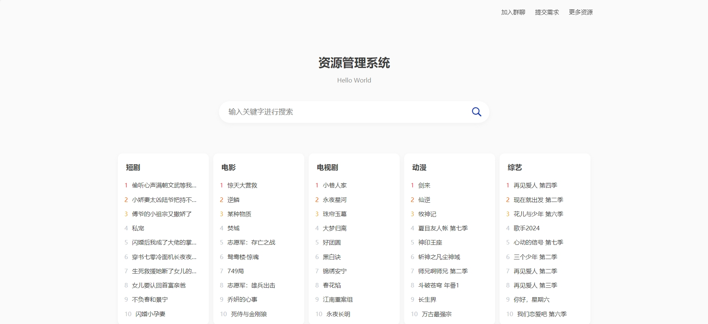
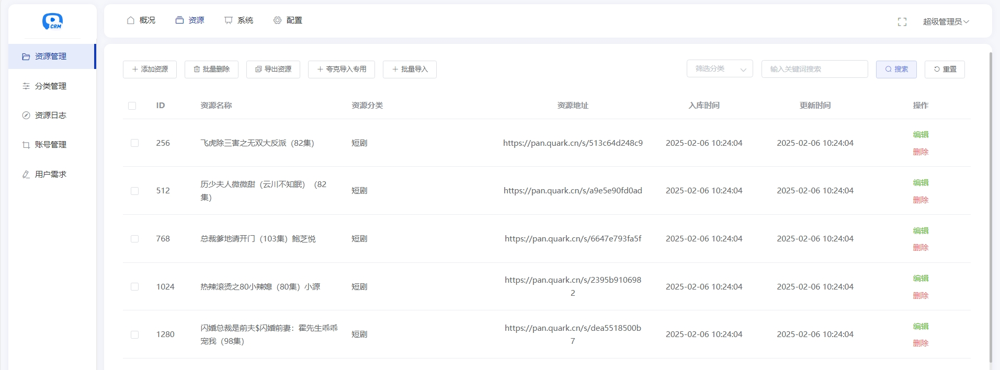
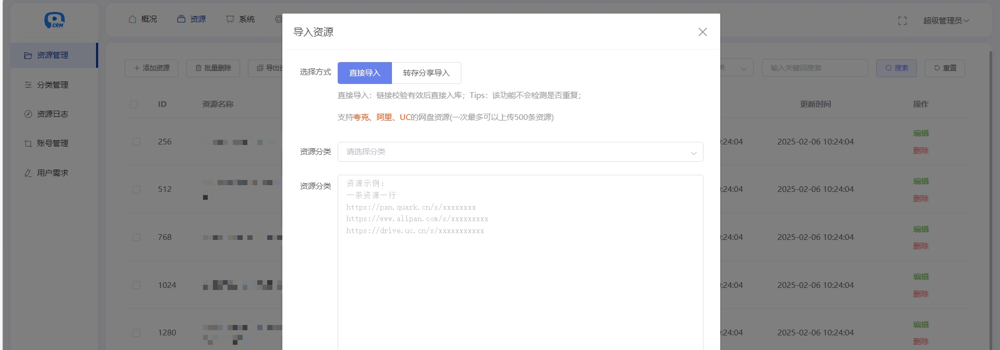

## ❤️ 网盘资源管理系统

**支持多网盘转存分享，支持夸克网盘、百度网盘、阿里云盘、UC网盘、迅雷云盘，网盘资源管理与索引工具！**

---

## 🔔 温馨提示

📌 **本项目仅供技术交流与学习使用**，自身不存储或提供任何资源文件及下载链接。

📌 **请勿将本项目用于任何违法用途**，否则后果自负。

📌 **项目本身不集成任何第三方资源采集源或链接信息**，所有功能需由用户自行配置。

📌 如有任何问题或建议，欢迎交流探讨！ 😊

> **免责声明**：本项目由 Trae AI 辅助编写。由于时间有限，仅在空闲时维护。如遇使用问题，请优先自行排查，感谢理解！

---

## 🔒 法律声明与使用协议（Legal Disclaimer & Terms of Use）
- **使用本项目即表示您同意以下条款：**
1. 本项目为开源项目，仅供技术学习与交流使用；
2. 项目未集成任何资源文件、下载地址或版权内容；
3. 项目不提供也不支持任何侵犯版权、传播盗版等非法行为；
4. 若用户将本项目用于搭建违法网站或传播侵权资源，责任由用户自行承担，与项目作者无关；
5. 本项目作者不对因使用本项目而产生的任何直接或间接后果承担法律责任；
6. 若您不同意上述条款，请勿下载、使用或传播本项目；

---

## 📄 许可证

**本项目采用 MIT 许可证。详情请见 <a href="./LICENSE">LICENSE</a> 文件。**

---

## 🚀 更新日志

### v3.6
- 🔄 新增 支持迅雷云盘转存导入，一键批量导入更高效
- 🌐 全网搜新增 迅雷云盘支持，搜索范围更广
- 🛠 修复百度网盘跳转页面不存在的问题
- 📊 修复首页排行榜序号，解决个别情况下的报错
- 🐞 修复上个版本已知的bug

### v3.5
- 🌐 全网搜新增UC网盘支持
- 🔄 全网搜自动跳转功能：本地无资源时，可自动跳转全网搜索
- ⚙️ 全网搜优先顺序设置：支持夸克网盘、百度网盘、UC网盘，优先顺序根据接口配置决定
- 🚫 全网搜屏蔽关键词功能：支持自定义屏蔽搜索关键词
- 🏠 首页展示数据来源设置：默认显示网络热门资源，现在可切换为本地资源

### v3.2
- 🔄 新增 全网搜索线路配置功能，支持自定义搜索线路
- 🌐 新增 多类型搜索源支持：API接口、TG频道、网页爬虫
- ⚙️ 新增 后台搜索线路管理界面
- 🛠 优化 搜索架构，由固定接口改为可配置模式
- 📊 搜索线路权重设置，支持优先级调整

### v3.1
- 🔍 优化 全网搜索模式：由直接展示转存结果，改为先显示第三方搜索结果，用户点击后再转存分享
- 🌐 全网搜索支持 夸克网盘 和 百度网盘
- 🔗 新增 全网搜转存模式：可选转链或直链展示
- 🕵️ 新增 全网搜的结果先进行资源有效性过滤（仅支持夸克）
- 💻 新增 PC端访问方式选择（跳转/扫码）
- 🧱 重构视图结构，将前后台的html及静态文件放至public/views

### v3.0
- 🌟 **新增** 一键安装向导，简化部署流程
- 🔗 **新增** 多网盘转存导入功能，支持 **夸克、阿里、百度、UC**
- ⚡ **优化** 解决部分数据导致的路由异常问题
- 🤖 **优化** AI 重构转存功能，显著提升稳定性与效率

### v2.1
- 🌍 **新增** 网页全网搜索功能
- 💬 **接入** 微信对话开放平台
- 🔍 **优化** SEO 及搜索体验
- 🗑 **新增** 后台批量删除功能
- 📥 **优化** 数据导入功能

### v2.0
- 🎨 **全新 UI 设计**：不再使用 Uniapp，焕然一新
- 🔍 **SEO 进阶优化**：新增后台 SEO 配置、伪静态网址、网站地图等
- 🎭 **个性化定制**：支持自定义首页背景图、背景色等样式
- 🏆 **搜索模式升级**：支持 **精准搜索、模糊搜索、分词搜索**
- 🚀 **新增** 资源转存广告过滤功能
- 📦 **新增** 批量导入转存功能
- 🔗 **支持** 多网盘导入（目前夸克支持转存分享）
- 📂 **新增** 资源分类管理

---

## 📖 搭建教程

📌 **<a href="https://tcn6g7hyxvir.feishu.cn/wiki/WYT4wZtrjijeswkI0RSc4ofTnah" target="_blank">完整搭建教程</a>**

---

## 🌟 项目截图

### **前台界面**

### **后台管理**

---

## 💬 交流 & 讨论

加入交流群，与更多开发者交流学习！

📌 **添加微信** `l1417716300` 添加时请备注来源（如果项目对你有所帮助，也可以请我喝杯咖啡 ☕️ ~）

📌 **扫码加入交流群** 👇

|  |  |
| --- | --- |

> **温馨提示**：项目代码免费开放，但不提供搭建服务，如有问题可在群内讨论或私信咨询。

---
