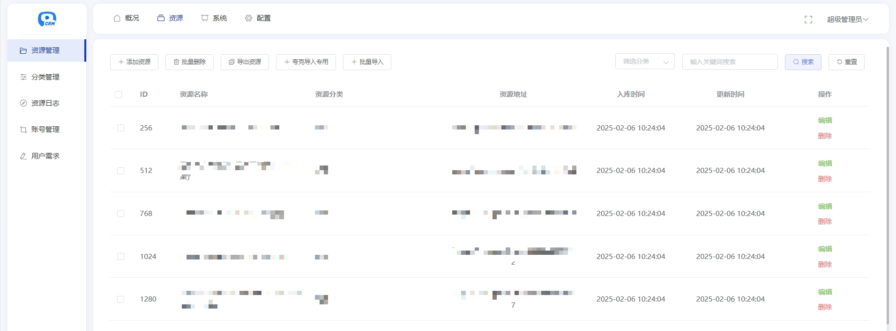

## ❤️心悦搜索

免费分享百万级网盘资源，致力打造顶尖网盘搜索引擎，让您畅享资源无忧！

## 🔔温馨提示

📌 本项目仅供技术交流与学习使用，项目本身不存储、不提供任何资源文件或下载链接。

📌 请勿将本项目用于任何非法用途，否则后果自负。

如有任何问题或建议，欢迎交流探讨！ 😊

> **声明**：本项目由 Trae AI 辅助编写。由于本人时间有限，仅在空闲时维护。如遇使用问题，请优先自行排查，感谢理解！

## 更新日志

### v3.0 

- 新增 项目安装向导，简化部署流程
- 新增 多网盘转存导入功能，支持夸克、阿里、百度、UC
- 优化 解决部分数据导致的路由报错
- 优化 AI重构转存功能，提升稳定性与效率

### v2.1

- 增加网页全网搜功能
- 对接微信对话功能
- 更新优化Seo
- 后台增加批量删除功能
- 优化表格导入功能

### v2

- UI改版：不再使用uniapp
- 优化Seo：增加后台配置seo参数、伪静态网址、网站地图等
- 自定义首页背景图、背景色等样式
- 优化搜索模式：支持精准搜索、模糊搜索、分词搜索
- 增加转存过滤删除广告的功能
- 增加批量导入转存功能
- 支持多网盘导入功能(目前仅夸克支持转存分享)
- 增加资源分类功能

## 搭建教程

[教程](https://tcn6g7hyxvir.feishu.cn/wiki/WYT4wZtrjijeswkI0RSc4ofTnah)

## 前台截图

## 后台管理截图

# 免费交流社群

可以进交流群,一起交流学习，添加时请备注来源（如果项目对你有所帮助，也可以请我喝杯咖啡 ☕️ ~）
请加微信l1417716300

|  |  |
| --- | --- |

程序使用不收费，但不负责搭建，搭建过程遇到问题，可以私聊或群里咨询

