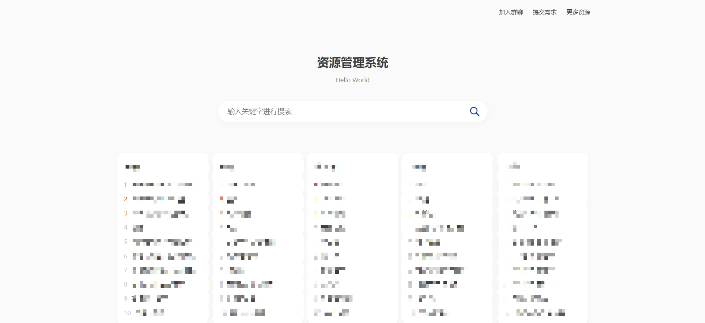

## ❤️ 心悦搜索 | Xinyue Search

**支持多网盘转存分享，支持夸克网盘、百度网盘、阿里云盘、UC网盘，打造高效便捷的网盘资源搜索引擎！**

---

## 🔔 温馨提示

📌 **本项目仅供技术交流与学习使用**，自身不存储或提供任何资源文件及下载链接。

📌 **请勿将本项目用于任何违法用途**，否则后果自负。

📌 如有任何问题或建议，欢迎交流探讨！ 😊

> **免责声明**：本项目由 Trae AI 辅助编写。由于时间有限，仅在空闲时维护。如遇使用问题，请优先自行排查，感谢理解！

---

## 🚀 更新日志

### v3.0
- 🌟 **新增** 一键安装向导，简化部署流程
- 🔗 **新增** 多网盘转存导入功能，支持 **夸克、阿里、百度、UC**
- ⚡ **优化** 解决部分数据导致的路由异常问题
- 🤖 **优化** AI 重构转存功能，显著提升稳定性与效率

### v2.1
- 🌍 **新增** 网页全网搜索功能
- 💬 **接入** 微信智能对话系统
- 🔍 **优化** SEO 及搜索体验
- 🗑 **新增** 后台批量删除功能
- 📥 **优化** 数据导入功能

### v2.0
- 🎨 **全新 UI 设计**：不再使用 Uniapp，焕然一新
- 🔍 **SEO 进阶优化**：新增后台 SEO 配置、伪静态网址、网站地图等
- 🎭 **个性化定制**：支持自定义首页背景图、背景色等样式
- 🏆 **搜索模式升级**：支持 **精准搜索、模糊搜索、分词搜索**
- 🚀 **新增** 资源转存广告过滤功能
- 📦 **新增** 批量导入转存功能
- 🔗 **支持** 多网盘导入（目前夸克支持转存分享）
- 📂 **新增** 资源分类管理

---

## 📖 搭建教程

📌 **[完整搭建教程](https://tcn6g7hyxvir.feishu.cn/wiki/WYT4wZtrjijeswkI0RSc4ofTnah)**

---

## 🌟 项目截图

### **前台界面**

### **后台管理**

---

## 💬 交流 & 讨论

加入交流群，与更多开发者交流学习！

📌 **添加微信** `l1417716300`（备注来源）

📌 **扫码加入交流群** 👇

|  |  |
| --- | --- |

> **温馨提示**：项目代码免费开放，但不提供搭建服务，如有问题可在群内讨论或私信咨询。

---
